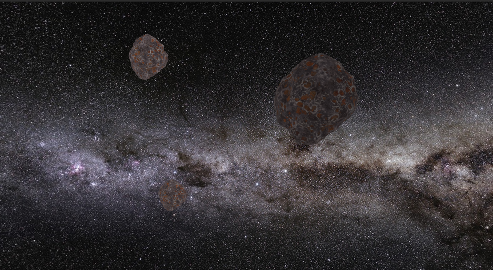

# Komande
* `wasd / mouse scroll` - pomeranje kamere / zoom
* `hold left ctrl` - kamera ne prati kursor
* `up` - kamera se pomera nagore
* `down` - kamera se pomera nadole
* `B` - uključivanje i isključivanje Blinn-Phong modela osvetljenja

# Galerija

# Implementirane dodatne oblasti iz grupe A:
* Cube mapping

# Zahvalnosti:
**[Panorama korišćena za skybox](https://www.eso.org/public/images/eso0932a/)**

**[Softver korišćena za pravljenje skzboxa od prethodne panorame](https://jaxry.github.io/panorama-to-cubemap/
)**

**[Model vanzemaljca](https://sketchfab.com/3d-models/alien-bc4db76ad4b54451b07d035cdaeed7de)**

**[Model drveta](https://sketchfab.com/3d-models/alien-tree-on-floating-rock-33ff8ff75e9147bfa8db0cad490c1e05)**

**[Model meteora](https://sketchfab.com/3d-models/meteor-d3a5a7e9a7d24b76841bf0f49d56a5f3)**

**[Model ostrva](https://sketchfab.com/3d-models/alien-world-explorer-f73af15ccc2849098df32f48133cba9b)**

**[Model biljke](https://sketchfab.com/3d-models/alien-plant-142addd0188c49e18e6d836fb9dfe813)**

**[Model platforme](https://sketchfab.com/3d-models/sci-fi-platforms-a6e8bb63ff5a41f5a9e1e7b0511cf79a)**

**[Model svemirskog broda](https://sketchfab.com/3d-models/space-ship-lost-in-space-d08cdc5470c0428aa048167f2a295ffd)**

**[Model NLO-a](https://sketchfab.com/3d-models/retro-ufo-a198a969caed46f4b58ff30167339650)**

# Uputstvo
1. `git clone https://github.com/matf-racunarska-grafika/project_base.git`
2. CLion -> Open -> path/to/my/project_base
3. Main se nalazi u src/main.cpp
4. Cpp fajlovi idu u src folder
5. Zaglavlja (h i hpp) fajlovi idu u include
6. Šejderi idu u folder shaders. `Vertex shader` ima ekstenziju `.vs`, `fragment shader` ima ekstenziju `.fs`
7. ALT+SHIFT+F10 -> project_base -> run

Skelet za projekat je https://github.com/matf-racunarska-grafika/project_base.git 

